# Latest Online Course Platform Collection (With Detailed Review)

Ever felt overwhelmed trying to figure out which platform can actually handle your courses, memberships, digital downloads, AND email marketing without forcing you to juggle five different subscriptions? Or maybe you're tired of platforms that look simple but then nickel-and-dime you with transaction fees that eat into every sale? Online course platforms solve this by consolidating everything creators need—from course hosting to payment processing to email automation—into unified systems that let you focus on teaching instead of tech troubleshooting.

## [Podia](https://www.podia.com)

An all-in-one creator platform combining courses, digital downloads, coaching, webinars, communities, and email marketing with zero transaction fees on higher plans.

Podia eliminates the complexity plaguing most course platforms through its clean, intuitive interface that non-technical creators appreciate. The platform handles online courses with unlimited video uploads, quizzes, drip content, and course certificates. Digital downloads support ebooks, templates, video files, audio files, and spreadsheets. Coaching functionality schedules one-on-one sessions and group consultations. Webinars and workshops run directly through the platform.

**Community features** provide both free and paid online spaces where students interact, ask questions, and support each other. Public and private community options accommodate different business models. Members post, comment, and receive notifications, creating engaged learning environments. Unlike competitors requiring separate community platforms, Podia bundles this functionality natively.

**Built-in email marketing** sets Podia apart from course-only platforms. Create automated email sequences, send broadcasts, segment audiences, and track performance without paying for MailChimp or ConvertKit. Landing page builder generates opt-in pages capturing leads. Website builder with blogging tools handles your entire content strategy from one dashboard.

Pricing reflects straightforward value: Mover plan at $39 monthly (or $33 annually) provides unlimited products, unlimited customers, unlimited file storage, course certificates, coupons, upsells, waitlists, and video uploads in community spaces. Five-percent transaction fees apply. Shaker plan at $89 monthly eliminates transaction fees entirely and adds advanced features including third-party code implementation, bulk student imports, and priority support. Free plan offers one coaching product, one download, and community access with ten-percent transaction fees.

Migration assistance moves up to 20 products free on Mover, 30 products free on Shaker. Integrations connect with Google Analytics, Stripe, PayPal, Mailchimp, Drip, and Zapier. Unlimited everything—customers, messages, files—means no usage limits or unexpected fees. Seven-day-per-week email support plus live chat ensures help when needed.

## [Thinkific](https://www.thinkific.com)

A comprehensive course platform emphasizing structured learning experiences with built-in email marketing, live sessions, and AI-powered tools.

Thinkific positions itself as the complete solution for creators wanting robust course features without technical headaches. The platform excels at building multi-layered courses with modules, lessons, PDFs, videos, quizzes, assignments, prerequisites, and drip content. Progress tracking, certificates, and surveys provide everything needed for structured learning experiences.

Course creation utilizes AI-powered drag-and-drop builders that simplify complex setups. Multiple question types in assessments test student comprehension thoroughly. Brillium integration enables professional exam solutions with advanced assessment features. Live event hosting connects instructors with students synchronously.

**Native email marketing** eliminates third-party email tool expenses. Run sales campaigns, segment audiences, send abandoned cart reminders, and automate follow-ups. Clean website and landing page builders come with customizable templates. Community spaces facilitate discussions with private forums connecting lesson content to conversations.

Payment processing handles transactions globally including payment plans, subscriptions, and Buy Now Pay Later options through Klarna and Afterpay. Membership packages generate recurring revenue. Coupons and promotional tools boost sales.

Starting price of $49 monthly positions Thinkific competitively. Free plan provides basic functionality for testing. Integration marketplace connects to hundreds of tools, plus Zapier expands possibilities further. Cross-platform availability ensures students access content anywhere.

## [Kajabi](https://www.kajabi.com)

An all-in-one premium platform providing courses, marketing funnels, email automation, websites, and analytics for serious course businesses.

Kajabi brands itself as the complete business operating system for knowledge entrepreneurs. The platform bundles course creation, website building, email marketing, sales funnels, and analytics into one subscription. This consolidation appeals to creators wanting everything under one roof without juggling multiple tools.

**Learning experience quality** surpasses many competitors through features like live video sessions and coaching integrated directly into courses. Group challenges keep students engaged through gamification. Community tools include access groups and live streaming for interactive experiences. Course assessments through quizzes and assignments track student progress.

Marketing automation shines with fully automated funnels for different use cases. Email marketing suite handles campaigns, sequences, and segmentation. Opt-in forms capture leads across your digital properties. Sales pages and checkout flows optimize conversion.

Website and landing page builders create professional online presence without coding. Customizable templates suit various industries. Membership subscriptions generate recurring revenue streams. Analytics and reporting provide insights into student engagement and business performance.

Pricing starts at $119 monthly, reflecting premium positioning. The investment makes sense for established creators and businesses generating significant revenue who value the all-inclusive approach. New creators or those testing ideas may find it expensive. Thirty-day free trial allows thorough evaluation.

## [Teachable](https://www.teachable.com)

A beginner-friendly course platform focused on simplicity, offering straightforward course creation with minimal learning curve.

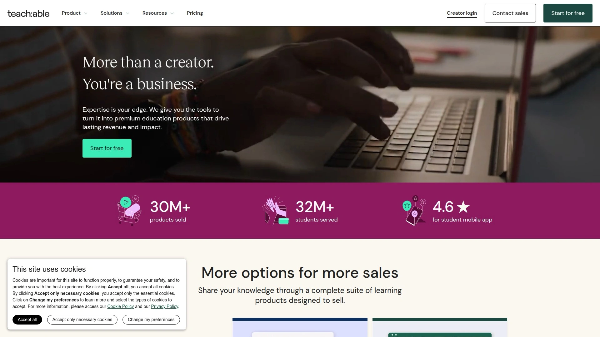

Teachable emphasizes ease of use over feature complexity, making it ideal for first-time course creators. Course setup requires minimal technical knowledge. Drag-and-drop builder arranges lessons intuitively. Multimedia support includes video, audio, PDFs, quizzes, and text content.

**Simplest onboarding** in the industry gets courses published quickly. Templates provide starting points. Customization options balance simplicity with branding needs. Students navigate courses easily through clean interface design.

Basic marketing features include coupons, sales pages, and email capture. However, email marketing capabilities lag behind Thinkific and Kajabi. Third-party tools handle advanced marketing needs. Payment processing supports major payment methods.

Pricing begins at $39 monthly when billed annually, $49 monthly otherwise. Transaction fees apply on lower tiers. Free trial tests functionality before committing. Unlimited students and courses prevent scaling limitations.

Integration with Zapier connects to thousands of apps. Community features exist but remain basic compared to dedicated community platforms. Best suited for creators prioritizing quick launch over comprehensive features.

## [LearnWorlds](https://www.learnworlds.com)

A professional course platform emphasizing engagement, interactivity, SCORM compliance, and structured learning paths.

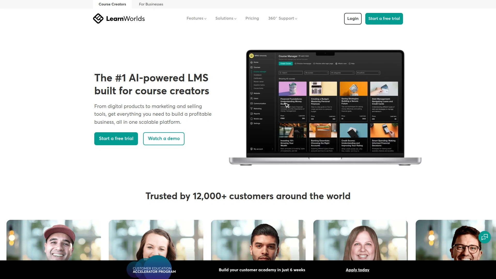

LearnWorlds targets creators wanting sophisticated learning experiences beyond basic video lessons. Interactive video tools add questions, notes, and calls-to-action directly into video content. SCORM support enables importing existing training materials. Learning paths guide students through prescribed course sequences.

**Social learning features** encourage peer interaction through community discussion boards, private messaging, and collaborative projects. Gamification with points, badges, and leaderboards motivates completion. Certificates automatically generate upon course completion.

Assessment capabilities include quizzes, assignments, and exams with multiple question types. Detailed analytics track student progress, engagement patterns, and learning outcomes. Instructor tools facilitate feedback and grading.

Website builder creates branded online schools with customizable themes. Sales page templates optimize conversion. Email marketing tools segment audiences and automate campaigns. Payment processing handles subscriptions, one-time payments, and installment plans.

Starting price of $29 monthly when billed annually makes it accessible. Higher tiers add advanced features like white-label solutions and custom app development. Free trial period allows testing. Strong choice for educators and trainers prioritizing learning experience quality.

## [Mighty Networks](https://www.mightynetworks.com)

A community-first platform combining course hosting with robust social features, ideal for membership sites emphasizing interaction.

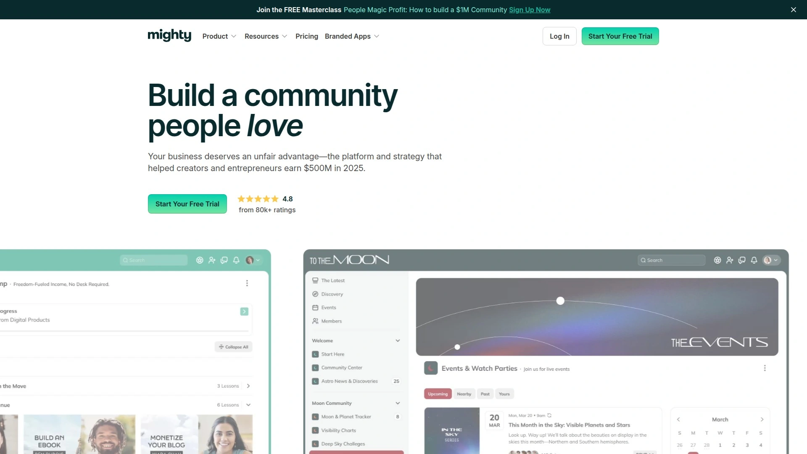

Mighty Networks prioritizes community over courses, making it perfect for businesses where connection matters as much as content. The platform blends course materials with group chats, polls, events, and discussion forums in unified spaces. This integration fosters interactive learning environments.

**Live streaming** happens directly in the web and mobile apps. Record streams for later viewing. Interactive discussion boards help members connect and engage. Direct messaging and group messages facilitate private conversations. Activity feeds keep communities updated.

Course creation tools provide video lessons, quizzes, and assessments. Drip scheduling controls content release. Pass requirements ensure students master material before advancing. However, course features remain simpler than specialized course platforms.

Separate spaces within networks allow selling different content, courses, or events. Membership tiers create varied access levels. Payment processing integrates Stripe. Mobile apps for iOS and Android deliver native experiences.

Pricing starts at $99 monthly. Transaction fees apply to sales. No limits on members or spaces. Integration with Zapier, WordPress, and Zoom extends functionality. Best for community-centric businesses where courses supplement interaction.

## [Circle](https://circle.so)

A modern community platform recently expanding into course hosting, offering clean design and excellent member management.

Circle excels at community management, positioning courses as complementary features rather than core offerings. The platform provides private chat rooms, private messaging, live streams, searchable member databases, and discussion spaces. Clean interface design emphasizes user experience.

**Course curriculum builder** uploads videos, audio, PDFs, and images. Content organization through modules and lessons structures learning. Drip scheduling releases content on schedules. Progress analytics show completion rates. However, quizzes and assessments require third-party integrations.

Engagement tools include polls, events, and member directories. Moderation features maintain community standards. Tagging and segmentation organize members. Mobile apps provide access anywhere.

Checkout pages and payment processing handle transactions directly. Membership tiers create revenue streams. Transaction fees apply like Mighty Networks. Starting at $89 monthly positions Circle competitively.

Integration capabilities connect to essential business tools. API access enables custom development. Best for creators building communities first, courses second. Simpler course layout compared to Mighty Networks.

## [Udemy](https://www.udemy.com)

The largest course marketplace connecting instructors with millions of students worldwide, handling marketing while limiting creator control.

Udemy provides instant access to massive audiences, eliminating the hardest part of course creation—finding students. Over 213,000 courses attract 76 million learners globally. Instructors benefit from platform trust and visibility.

**Marketplace model** means Udemy handles marketing, promotional campaigns, and student acquisition. Courses appear in search results and recommendations automatically. New instructors reach students without existing audiences. However, Udemy controls pricing during sales events, often discounting courses heavily.

Revenue sharing gives instructors percentage of sales, varying based on how students arrived. Organic traffic through Udemy search provides better instructor percentages than paid advertising referrals. This structure favors Udemy over creators on profit margins.

Course creation tools support video lectures, quizzes, assignments, and downloadable resources. Mobile apps enable learning anywhere. Student reviews and ratings build credibility. Lifetime access model means students own courses permanently.

Free to upload courses—Udemy only profits when courses sell. No monthly fees make it risk-free for beginners. However, lack of student data and email access limits relationship building. Best for instructors wanting exposure without marketing responsibilities.

## [Skillshare](https://www.skillshare.com)

A creative-focused marketplace emphasizing project-based learning, ideal for arts, design, and creative skill instruction.

Skillshare specializes in creative education—illustration, photography, design, writing, and similar disciplines. Project-based approach encourages students to create work while learning. Community feedback on projects enhances learning.

**Subscription model** differs from Udemy's individual course sales. Students pay monthly for unlimited access to entire catalog. Instructors earn based on minutes watched rather than direct sales. This royalty system rewards engaging content that retains attention.

Short-form classes typically run 20-60 minutes, focusing on actionable skills. Interactive elements encourage practice. Instructors build followings through consistent publishing. Platform handles all marketing and discovery.

Free to publish, with instructors sharing subscription revenue. Built-in audience provides immediate visibility. However, earnings per student are generally lower than direct course sales. No control over pricing or student data.

Best for creative professionals wanting passive income from teaching without building platforms. Community engagement high among creative learners. Mobile-first design suits casual learning.

## [Coursera](https://www.coursera.org)

An academic-focused platform partnering with universities and organizations to offer professional development and degree programs.

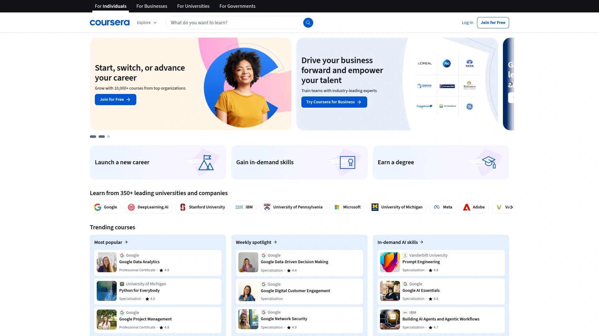

Coursera emphasizes academic rigor and professional credentials through partnerships with top universities worldwide. Courses, specializations, and full degree programs attract learners seeking formal education. Content quality aligns with university standards.

**Certificate programs** provide verifiable credentials recognized by employers. Professional certificates from companies like Google, IBM, and Meta teach in-demand skills. MasterTrack programs offer graduate-level learning. Full degrees happen entirely online.

Subscription and individual course options accommodate different learning goals. Financial aid makes education accessible. Mobile apps enable flexible learning. Peer-reviewed assignments ensure comprehension.

Platform targets professional development and career advancement. High production values create polished learning experiences. However, individual instructors cannot publish unless affiliated with partner institutions. This exclusivity maintains quality but limits access.

Best for learners investing in career credentials and professional skills. Less suitable for hobbyists or casual learning. Strong reputation enhances resume value.

## [LearnDash](https://www.learndash.com)

A powerful WordPress LMS plugin transforming WordPress sites into full-featured learning management systems.

LearnDash provides comprehensive LMS functionality for WordPress users wanting complete control over their learning environment. The plugin adds course management, quizzes, assignments, certificates, and user tracking to existing WordPress sites. This approach suits creators already invested in WordPress ecosystems.

**Advanced features** include drip content, prerequisites, course forums, and gradebook functionality. ProPanel dashboard displays student progress and engagement analytics. Course builder supports multimedia content. Gamification through points and badges motivates learners.

Integration with MemberPress enables sophisticated membership models. Bundle courses into membership tiers. Automatic enrollment and unenrollment based on membership status. Sell courses as one-time purchases, subscriptions, or memberships.

Pricing starts at $199 annually for plugin license, or $25 monthly for hosted solution. One-time payment provides lifetime access to specific version. More affordable than hosted platforms long-term. However, requires WordPress knowledge and hosting management.

Third-party integrations connect to payment processors, email marketing tools, and webinar platforms. Theme compatibility ensures design flexibility. Best for tech-comfortable creators wanting full platform control.

## [MemberPress](https://www.memberpress.com)

A WordPress membership plugin excelling at access control, subscription management, and content protection.

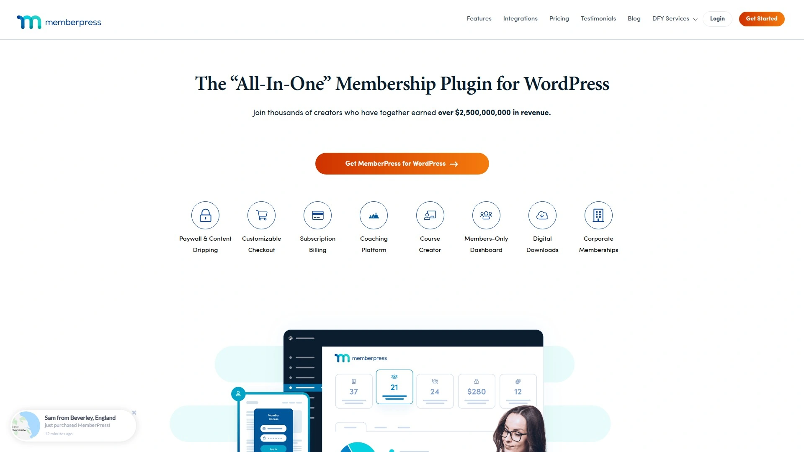

MemberPress specializes in membership site creation, handling user management, content restrictions, and recurring billing. The plugin protects any WordPress content including pages, posts, videos, and courses behind membership paywalls. Flexible rules determine who accesses what content.

**Membership levels** create tiered access structures. Sell courses individually or bundle multiple courses into packages. Subscription management handles recurring payments, trial periods, and grace periods. Coupons and discount codes drive sales.

Integration with LearnDash combines membership functionality with course features. Automatic course enrollment when members subscribe. Content dripping releases material on schedules. Reports track membership metrics and revenue.

Payment gateway support includes Stripe, PayPal, and Authorize.net. One-click signup simplifies member registration. Email notifications keep members informed. Corporate accounts allow team access.

Pricing starts around $179 annually. Requires WordPress hosting. Best for membership sites with complex access needs. Works excellently with LearnDash for course-plus-membership models.

## [Systeme.io](https://systeme.io)

An affordable all-in-one platform combining funnels, courses, email marketing, and automation at aggressive pricing.

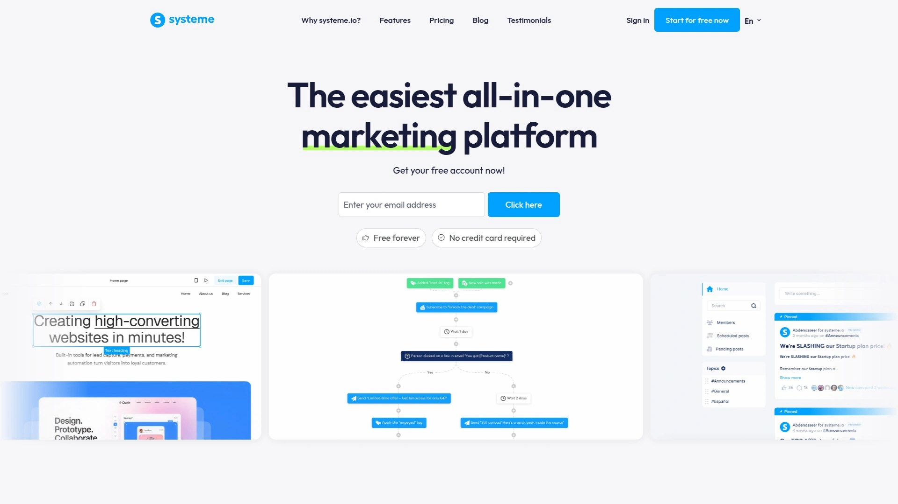

Systeme.io positions itself as the budget-friendly alternative to ClickFunnels and Kajabi, offering similar functionality at fraction of cost. The platform bundles funnel building, course hosting, email marketing, automation, webinars, and even blog functionality. This consolidation eliminates multiple tool subscriptions.

**Free tier** provides genuine functionality including three sales funnels, unlimited emails, and one course. Paid plans starting at $27 monthly unlock unlimited capabilities. No transaction fees on any plan. Lifetime deal option eliminates recurring costs entirely.

Course creation supports video lessons, quizzes, certificates, and drip content. Discussion areas enable student interaction. Video playback controls let students adjust speed and quality. Community features include public and private spaces.

Funnel builder creates sales funnels, webinar funnels, and product launch sequences. Email automation handles sequences, tags, and segmentation. Webinar hosting runs live and automated events. Shopping cart processes payments through Stripe and PayPal.

Simplicity over sophistication characterizes the interface. Less polished than ClickFunnels but far more affordable. Best for budget-conscious entrepreneurs wanting all-in-one functionality.

## [ClickFunnels](https://www.clickfunnels.com)

The dominant funnel-building platform offering course hosting, membership sites, and comprehensive marketing automation.

ClickFunnels pioneered the funnel-building category, establishing itself as the market leader. The platform excels at creating sales funnels that convert visitors into customers through optimized page sequences. Drag-and-drop editor builds funnels without coding.

**Membership functionality** creates course and content sites with access control. Students access training through membership portals. Professional-looking membership areas enhance brand perception. However, no built-in community features exist—external platforms like Circle handle student interaction.

Marketing automation includes email sequences, tags, and behavioral triggers. A/B testing optimizes funnel performance. Analytics track conversion rates and revenue. Templates provide proven funnel structures.

Course delivery happens through membership funnels. Video hosting, file downloads, and progress tracking work smoothly. Professional visual design looks polished. Organized dashboards give students easy access to content.

Pricing starts around $97 monthly with higher tiers adding features. Expensive compared to alternatives but includes extensive marketing tools. Best for businesses prioritizing sales funnels and marketing automation over pure course features.

## [Academy of Mine](https://www.academyofmine.com)

A high-end enterprise LMS providing white-label solutions, advanced customization, and dedicated support for large organizations.

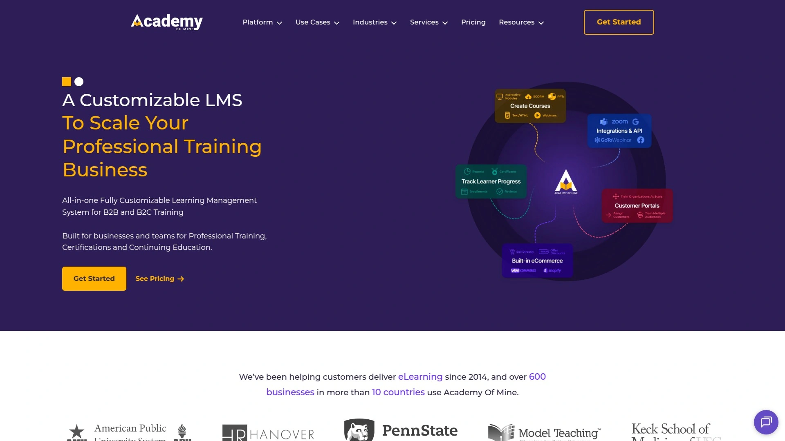

Academy of Mine targets enterprises and organizations requiring sophisticated learning ecosystems. White-label capabilities remove all Academy of Mine branding, creating fully branded learning experiences. Custom domains maintain brand consistency.

**Enterprise features** include SCORM compliance, xAPI tracking, advanced reporting, and role-based access controls. Multi-tenant architecture supports multiple training portals from single platform. API access enables deep integrations with business systems.

Custom development services build unique features matching organizational needs. Dedicated account managers provide personalized support. Migration assistance transitions existing courses and data. Training ensures teams utilize platform effectively.

Course authoring tools support diverse content types. Assessment capabilities include quizzes, assignments, and proctored exams. Certification management tracks credentials and renewals. Compliance reporting satisfies regulatory requirements.

Pricing starts at $599 monthly, reflecting enterprise positioning. Significant investment unsuitable for solopreneurs. Best for corporations, associations, and training companies needing scalable, white-label solutions.

## [TalentLMS](https://www.talentlms.com)

A cloud-based LMS emphasizing simplicity and quick deployment for employee training and customer education.

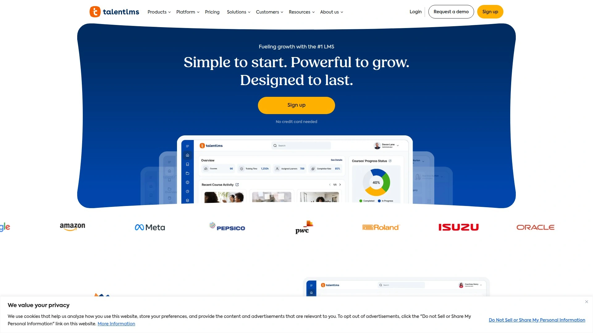

TalentLMS provides straightforward learning management without overwhelming complexity. The platform targets businesses training employees, partners, and customers. Quick setup gets training programs running rapidly.

**User-friendly interface** requires minimal training for administrators and learners. Course creation uses intuitive builders. Gamification adds points, badges, and leaderboards. Mobile apps deliver training anywhere.

Multiple training portals segment different audiences—employees, customers, partners—within single account. Branch management organizes large organizations. Reports track completion rates, quiz scores, and engagement.

Integration marketplace connects to HRIS systems, video conferencing tools, and business applications. API enables custom integrations. SCORM, xAPI, and cmi5 standards ensure content compatibility. E-commerce features sell courses externally.

Free plan supports up to five users. Paid plans start affordably, scaling with user count. Suitable for small to medium businesses prioritizing ease over advanced features.

## [Absorb LMS](https://www.absorblms.com)

An AI-powered learning management system streamlining training across employees, partners, and customers with intelligent automation.

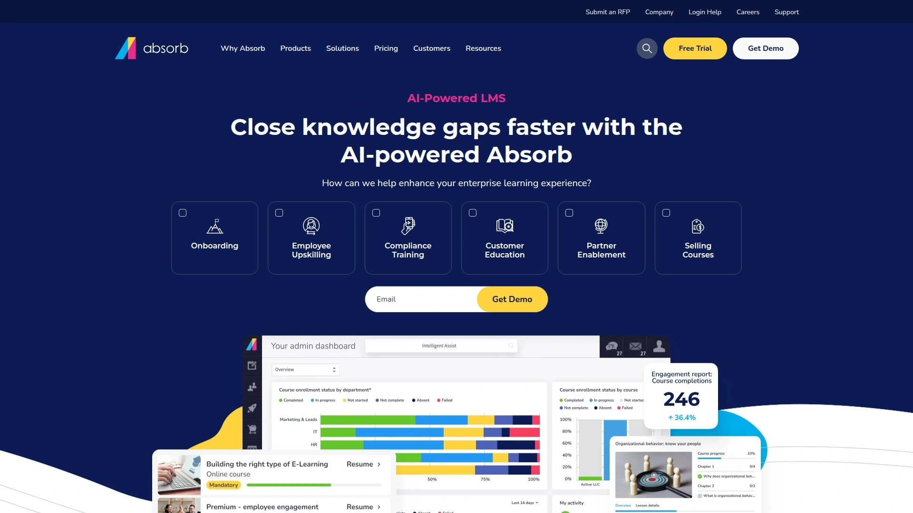

Absorb LMS leverages artificial intelligence to personalize learning experiences and automate administrative tasks. The platform serves enterprises training diverse audiences at scale. Intuitive interface simplifies setup despite sophisticated capabilities.

**AI features** recommend content based on learner behavior and preferences. Intelligent automation handles enrollment, notifications, and reporting. Natural language processing understands queries and surfaces relevant resources. Predictive analytics identify at-risk learners.

Content management organizes courses, videos, documents, and SCORM packages. Social learning features encourage peer interaction. Virtual classroom integration connects to Zoom, Teams, and WebEx. Mobile learning delivers training on any device.

Advanced reporting provides insights into training effectiveness, completion rates, and skill gaps. Compliance tracking ensures regulatory requirements are met. Multi-tenancy supports separate portals for different divisions or clients.

Enterprise-grade security protects sensitive training data. Single sign-on integrates with corporate identity systems. API enables deep integration with HR and business systems. Best for large organizations prioritizing intelligent automation.

## [Wisetail](https://wisetail.com)

An LMS and operations platform combining learning management with operational tools for frontline workforce training.

Wisetail targets businesses with frontline workforces—retail, hospitality, fitness—requiring training and operational management. The platform merges LMS functionality with operational tools like checklists and SOP management. Mobile-first design suits deskless workers.

**Drive content management** keeps SOPs, videos, and job aids organized and accessible. Real-time syncing ensures teams always access current information. OnTrack checklists manage operational activities beyond training. These tools close the gap between learning and doing.

Social learning features create community-building experiences. Discussion forums, peer-to-peer learning, and micro-learning support collaborative environments. Gamification motivates engagement. Instructor-led training supplements self-paced courses.

Analytics track both learning metrics and operational compliance. Two-point-one-five million active learners demonstrate scale. Sixty-seven-percent reduction in onboarding time shows effectiveness. Forty-percent faster time to productivity validates approach.

Pricing requires quotes as it varies by organization size and needs. Best for companies with large frontline teams needing integrated learning and operations management.

## [FreshLearn](https://freshlearn.com)

An intuitive course platform designed for creators and businesses wanting professional features without complexity.

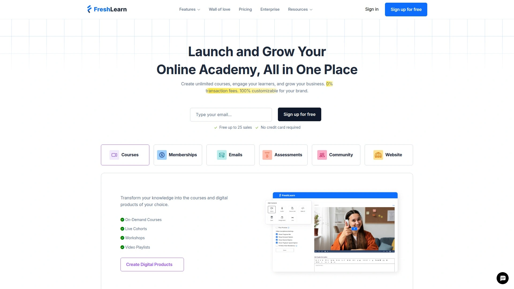

FreshLearn balances simplicity with sophisticated capabilities, appealing to creators outgrowing basic platforms. The all-in-one approach consolidates courses, communities, and marketing. Clean interface reduces learning curve.

Course builder supports video, audio, PDFs, and quizzes. Drip content releases lessons on schedules. Certificates reward completion. Unlimited courses and students prevent scaling limitations.

Community features facilitate student interaction through discussion forums. Email marketing tools segment audiences and automate campaigns. Landing page builder captures leads. Analytics track course performance.

White-label options remove FreshLearn branding. Custom domains maintain brand consistency. Payment processing handles subscriptions and one-time payments. Coupons drive sales.

Competitive pricing positions between budget and premium platforms. Free trial allows testing. Good fit for growing creators needing more than basic tools but not enterprise complexity.

## [EzyCourse](https://ezycourse.com)

A versatile course platform offering website building, course hosting, and community features at competitive pricing.

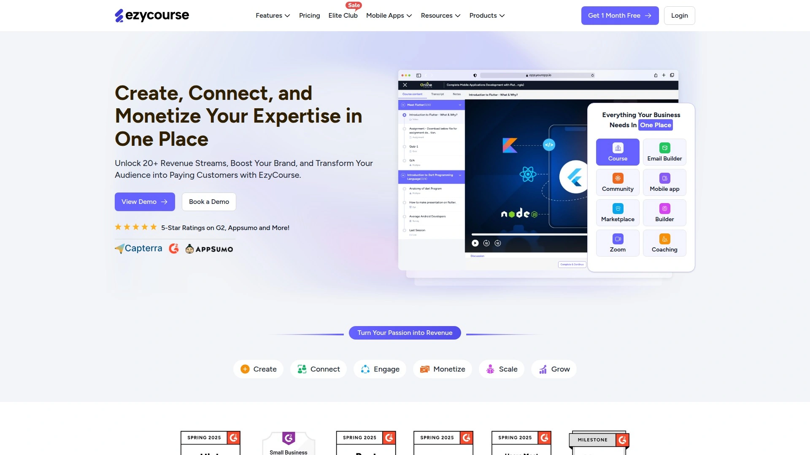

EzyCourse provides comprehensive functionality at accessible prices. The platform combines course creation, website building, and community management. This consolidation reduces tool sprawl.

Course creation tools support multimedia content with quizzes and assignments. Progress tracking monitors student advancement. Certificates automate upon completion. Drip scheduling controls content release.

Website builder creates branded learning portals. Blog functionality supports content marketing. Landing pages capture leads. SEO tools improve discoverability.

Community features enable member interaction through forums and messaging. Payment processing handles transactions globally. Email marketing automates communication. Analytics provide business insights.

Pricing competitive with similar platforms. Suitable for creators wanting feature-rich platform without premium pricing. Growing platform with active development.

## [Uteach](https://uteach.io)

A white-label course platform enabling creators to build branded learning businesses with comprehensive tools.

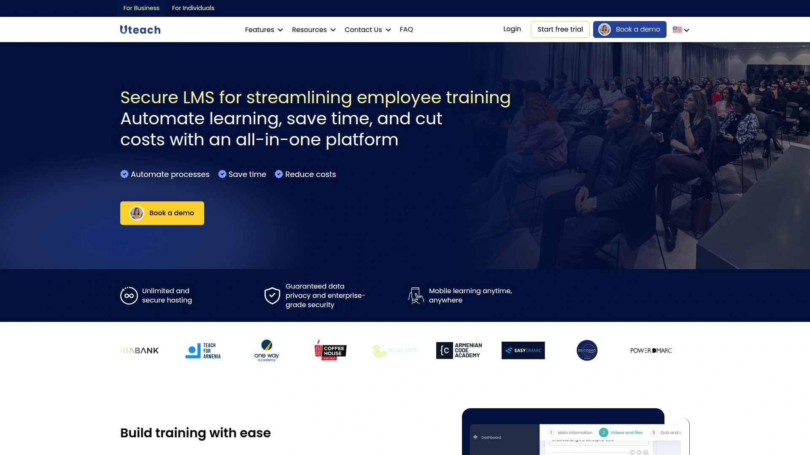

Uteach emphasizes white-label capabilities, allowing creators to fully brand their learning platforms. Custom domains remove Uteach references. This positioning appeals to creators prioritizing brand ownership.

Course creation supports various content types with structured curriculum builders. Live session capabilities add synchronous learning. Assessment tools include quizzes and assignments. Certificates automate credentialing.

Website builder creates complete learning portals. Marketing tools include email campaigns, coupons, and landing pages. Payment processing handles subscriptions and one-time sales. Analytics track student behavior and revenue.

Mobile app functionality ensures accessibility. Community features facilitate interaction. Integration capabilities connect to essential business tools.

Pricing scales with features needed. Good option for creators wanting white-label solution without enterprise pricing. Growing presence in creator economy.

## [AccessAlly](https://accessally.com)

A WordPress membership plugin combining course delivery with sophisticated membership management and marketing automation.

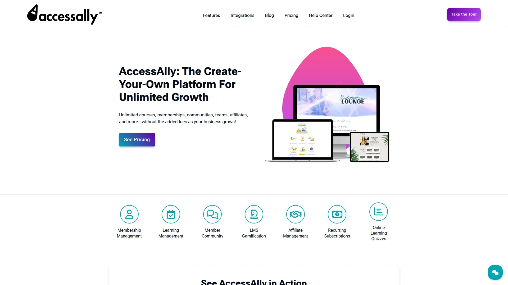

AccessAlly extends WordPress into powerful membership and course platform. The plugin integrates deeply with WordPress ecosystem. This approach suits creators already comfortable with WordPress.

Membership management creates complex access hierarchies. Course delivery includes multimedia content, quizzes, and progress tracking. Gamification through achievements and progress bars motivates learners.

Marketing automation connects with email platforms for sophisticated sequences. Integration with payment processors handles transactions. Community features leverage WordPress plugins.

Template library provides starting points for member areas and course layouts. Customization allows deep branding. Analytics track member behavior.

Pricing requires plugin purchase. Best for WordPress users wanting advanced membership features. Requires technical comfort with WordPress.

## [GrooveFunnels](https://www.groovefunnels.com)

A comprehensive digital marketing suite offering funnel building, course hosting, email marketing, and video hosting.

GrooveFunnels positions as all-in-one alternative to multiple marketing tools. The platform bundles funnel builder (GroovePages), email marketing (GrooveMail), course hosting (GrooveKart), video hosting, and more. This consolidation reduces subscription costs.

**Lifetime pricing** eliminates recurring monthly fees, requiring single payment for permanent access. This model appeals to creators wanting to avoid ongoing subscriptions. However, initial investment is higher.

Course creation through GrooveKart supports video lessons and assessments. Funnel builder creates sales sequences. Email marketing automates campaigns. Video hosting eliminates YouTube or Vimeo dependencies.

Template library provides starting points for various funnel types. Customization allows branding. Integration marketplace connects to business tools.

Platform still developing with features rolling out. Some functionality incomplete. Best for creators wanting lifetime deal over monthly subscriptions.

## [SchoolMaker](https://schoolmaker.com)

An e-learning platform focusing on online course management with intuitive tools for content organization.

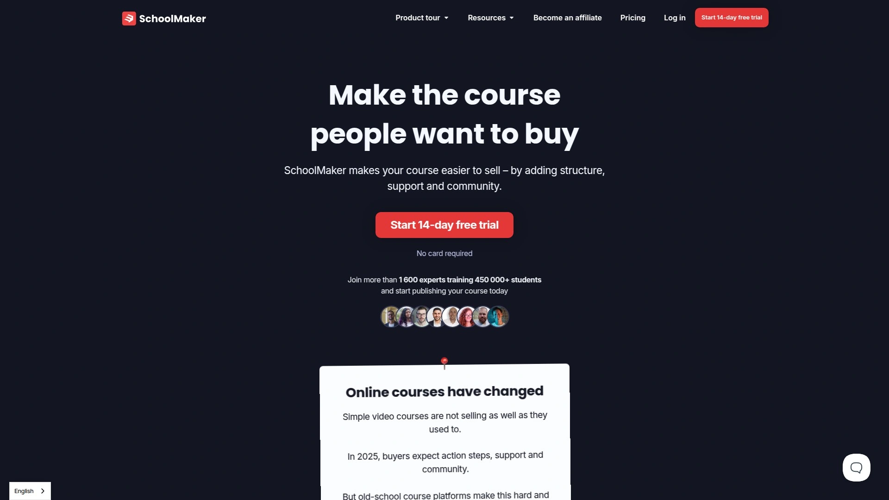

SchoolMaker provides straightforward course hosting and management. The platform emphasizes ease of use for non-technical users. Course creation tools support standard content types.

Organization features help structure complex curricula. Student management tracks enrollments and progress. Assessment tools include quizzes.

Payment processing handles transactions. Email notifications keep students informed. Basic reporting provides insights.

Suitable for educators and trainers needing simple course delivery. Less feature-rich than major platforms but adequate for straightforward needs. Pricing competitive for target market.

## [360Learning](https://www.360learning.com)

A collaborative learning platform emphasizing peer learning, user-generated content, and rapid course authoring.

360Learning differentiates through collaborative approach where subject matter experts create courses rapidly. Peer learning encourages knowledge sharing. User-generated content supplements formal training.

Rapid authoring tools enable non-instructional designers to build courses quickly. Collaborative features facilitate review and refinement. Social learning promotes interaction.

Enterprise features include advanced analytics, integrations, and security. Mobile learning delivers training anywhere. Multi-language support serves global organizations.

Best for enterprises wanting collaborative learning culture. Peer-driven approach requires culture fit. Pricing reflects enterprise positioning.

---

### How do course platforms differ from learning marketplaces like Udemy?

Course platforms give you complete control—you own student data, set your own prices, and keep higher profit margins since you're only paying subscription fees rather than revenue splits. Marketplaces provide instant audiences and handle all marketing, but they control pricing, take large revenue cuts, and prevent direct student relationships. Choose platforms when building your brand, marketplaces when prioritizing quick exposure.

### Do I need separate email marketing tools with these platforms?

Platforms like Podia, Thinkific, and Kajabi include built-in email marketing that handles campaigns, automation, and segmentation without additional subscriptions. Simpler platforms like Teachable offer basic email capture but require third-party tools for sophisticated campaigns. Budget $30-100 monthly for ConvertKit or MailChimp if your platform lacks email features.

### Can these platforms handle both courses and memberships?

Most modern platforms support both models—sell individual courses or package them into recurring memberships. Podia, Kajabi, Thinkific, and Circle all enable membership models with recurring billing, drip content, and community features. WordPress solutions like MemberPress specialize specifically in membership management.

***

### Conclusion

Creating and selling online courses shouldn't require managing five different tools and deciphering which features hide behind which paywall. The right platform consolidates everything you need—course hosting, payment processing, email marketing, and community building—into one system that actually makes sense. For creators wanting the simplest all-in-one solution combining unlimited courses, zero transaction fees on higher plans, built-in email marketing, and genuine community features without enterprise complexity or pricing, [Podia](#podia) delivers the most balanced package by eliminating the feature bloat and technical confusion plaguing competitors while still providing everything solo creators and small teams actually need to build sustainable course businesses.
